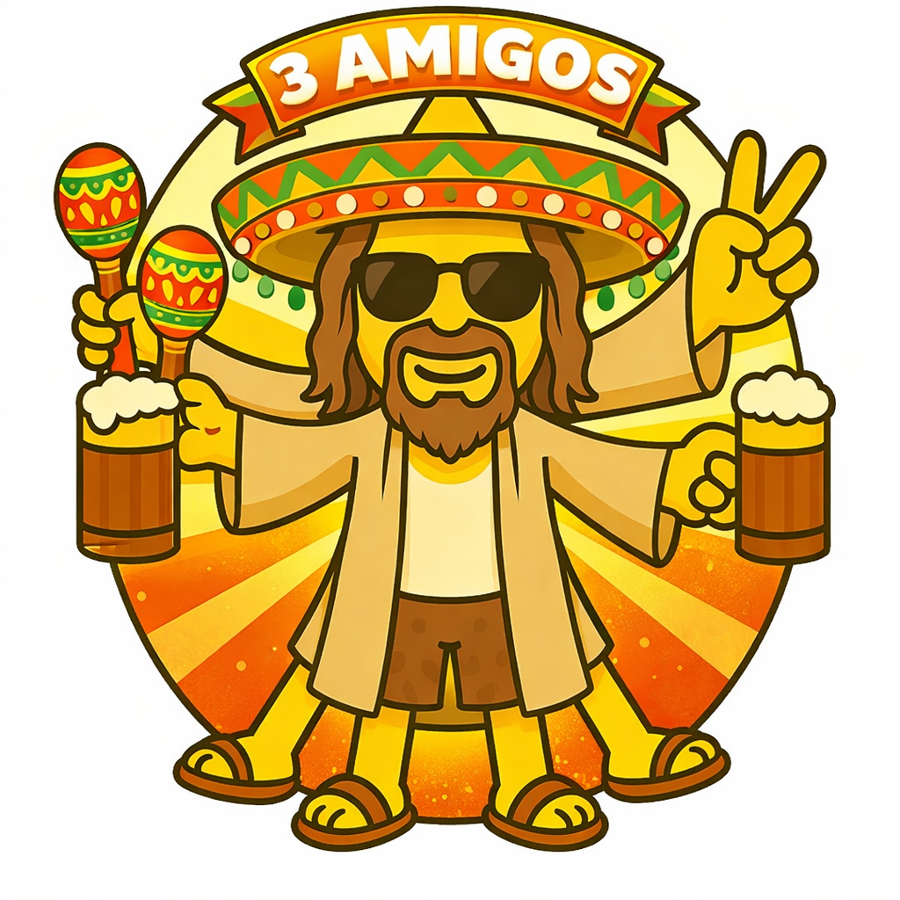

# Three Amigos for AI Agents

## Background

The Three Amigos is a collaborative discovery practice from the Agile/BDD community, built from three complementary ideas:

**George Dinwiddie** (2009) coined the term — three perspectives (business, dev, tester) examine a piece of work together *before* building it. The goal is shared understanding, not documentation.

**Matt Wynne** (Cucumber co-founder) made it concrete with **Example Mapping** — a timeboxed session using colored cards to structure the conversation:
- Yellow cards = the story (what are we building?)
- Blue cards = rules (what business rules emerge?)
- Green cards = examples (when THIS happens, THEN THAT)
- Red cards = questions (what don't we know yet?)

**Liz Keogh** added **Deliberate Discovery** — the practice of actively hunting for ignorance. The biggest project risk isn't what you know is hard, it's what you don't know you don't know. So go find it early, before code exists.

### Key references

- [George Dinwiddie's Three Amigos](https://blog.gdinwiddie.com/tag/three-amigos/)
- [Matt Wynne: Introducing Example Mapping](https://cucumber.io/blog/bdd/example-mapping-introduction/)
- [Liz Keogh: Deliberate Discovery](https://lizkeogh.com/category/deliberate-discovery/)
- [Agile Alliance glossary](https://agilealliance.org/glossary/three-amigos/)

## Applying Three Amigos to AI Agents

There's only one brain here — Opus. But by splitting it into three agent personalities, each with a distinct role and its own context window, we extract fundamentally different angles from the same model.

### Why it works

- **One brain, three angles** — same model (Opus), three agent personalities with narrow mandates extract different perspectives
- **Independent thinking first** — each forms their own take before seeing others, preventing groupthink
- **Cross-pollination** — the lead routes tensions between agents: "Liz raised X — Kent, is that feasible?"
- **Team context** — agents message each other and build on ideas across rounds; the conversation accumulates

### The loop

1. **Fan out** — present the story, let each think independently
2. **Synthesize** — read their replies, spot tensions, find gaps
3. **Cross-pollinate** — route challenges between agents
4. **Repeat** — they respond, you synthesize again
5. **Converge** — write the final example map

## The Cast

### liz

- Named after [Liz Keogh](https://lizkeogh.com) — Deliberate Discovery, BDD practitioner
- Hunts ignorance, surfaces assumptions, asks "what if?"
- The one who finds what you don't know you don't know

### kent

- Named after [Kent Beck](https://www.kentbeck.com) — XP, TDD, simplicity
- Grounds in code, checks feasibility, simplifies
- The one who asks "what's the simplest thing that could work?"

### dude (El Dude — the domain expert)

- The third slot — whoever knows the product best and speaks from the user's perspective
- Guards ubiquitous language, challenges terminology across all three layers (El, Dude, CC)
- A more generic choice would be an Eric (as in [Eric Evans](https://www.domainlanguage.com), Domain-Driven Design)
- In our case the domain is the dude itself, and El is his shell — El Dude abides
